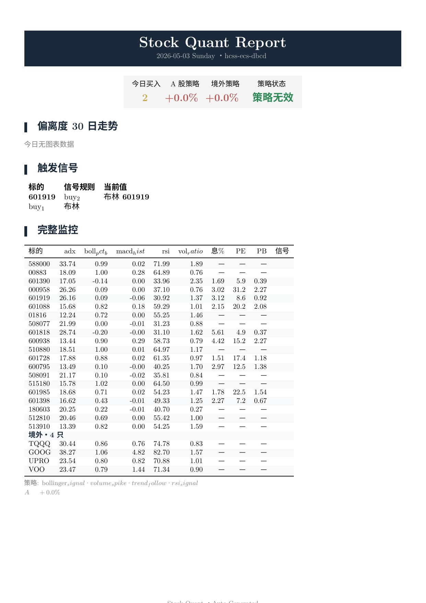

# 股票量化系统 (Stock Quant)

[](LICENSE)
[](https://python.org)
[]()

A股 / 美股 / 港股量化监控系统。策略搜索优化器自动发现最优交易信号，每日 xelatex LaTeX PDF 日报含信号扫描 + 回测分析 + 公式方法论附录，支持 HTML 交互报告链接。

## 核心功能

| 功能 | 说明 |
|------|------|
| **策略搜索优化器** | 贝叶斯优化自动搜索最优策略参数，条件构建器池 (RSI/MACD/Bollinger/ADX)，两阶段 (训练+测试) 防过拟合 |
| **信号扫描器** | 每日自动加载最新优化结果，计算 Top-5 策略共识，对当日数据评估买入信号 |
| **回测分析** | 用最新优化策略跑完整 24 月历史回测，3 阶段指标分拆，基准 ETF 对比 |
| **条件检测** | 多锚点阈值报警 (MA60/WMA20/WMA30/WMA50) + 优化策略信号报警 |
| **早盘简报** | 轻量价格+锚点快照，每日 09:50 自动发送，按偏离率升序排列 |
| **邮件提醒** | 日报含信号扫描+回测+公式附录，xelatex LaTeX PDF 附件 (港式财报风格) |
| **健康监控** | HTTP 健康检查服务器 (OTP 认证 + 管理后台 + 在线编辑监控列表) |
| **投资组合策略** | 共享资金池模拟，贪心前向选择，月度限额约束 |
| **规则引擎** | YAML 驱动，Python 表达式沙箱，23 个单元测试 |
| **公式附录** | LaTeX 排版 13 节指标方法论（RSI/布林/MACD/ADX/回测约束），xelatex 编译 |

## 日报预览



> 每日自动生成 LaTeX PDF 日报附件 (145KB)，含偏离度图、信号表、基本面列、公式方法论附录。港式财报风格。

## 快速开始

**首次部署？** → [部署五步走](docs/guide/setup.md)

```bash
pip install -r requirements.txt
cp config/.env.example config/.env   # 填入邮箱和 API Key (DeepSeek)
python main.py --once                # 单次收盘日报
python main.py --brief               # 单次早盘简报
python main.py --optimize            # 策略搜索优化 (15-30 min)
python main.py                       # 定时运行 (cron/APScheduler)
```

## 项目结构

```
src/
├── analysis/          # 策略优化器、信号扫描、指标库、规则引擎
│   ├── strategy_optimizer.py   贝叶斯优化搜索
│   ├── signal_scanner.py       每日共识信号扫描
│   ├── portfolio_strategy.py   共享资金池模拟
│   ├── rule_engine.py          YAML驱动规则引擎
│   ├── indicator_library.py    RSI/MACD/ATR/ADX
│   └── backtest_config.py     时间线模型
├── core/              # 数据拉取、条件检查、调度管理
├── data/              # 多源爬虫 (新浪/腾讯/东方财富/Yahoo)
├── alerting/          # 多层报警引擎 + 状态管理
├── session/           # Session 管理器
├── models/            # Pydantic 数据模型
├── notification/      # 邮件通知 + 图表生成
├── health_server/     # HTTP 健康检查 + 管理
├── utils/             # CJK 字体, ETF 检测
└── templates/         # HTML/CSS 模板
```

## CLI 命令

| 命令 | 说明 |
|------|------|
| `python main.py` | 启动定时调度器 (cron) |
| `python main.py --once` | 单次收盘日报 |
| `python main.py --brief [id]` | 早盘/收盘简报 (`morning_snapshot` / `afternoon_snapshot`) |
| `python main.py --optimize` | 策略搜索优化 |
| `python main.py --health-server` | 仅启动健康服务器 |

## 配置

- `config/config.yaml` — 监控标的、技术指标参数 (gitignored)
- `config/.env` — 邮箱密码、API Key (gitignored)
- `config/optimizer.yaml` — 搜索策略模板
- `config/alerts.yaml` — 多锚点报警配置

## 文档

| 文档 | 说明 |
|------|------|
| [设计决策](docs/llm/proj4llm.md) | 关键架构设计 + 技术路线 |
| [架构说明](docs/architecture.md) | 分层架构、数据流、模块职责 |
| [部署指南](docs/deployment.md) | 服务器部署 + CI/CD |
| [配置参考](docs/configuration.md) | config.yaml 详细说明 |
| [快速开始](docs/guide/quickstart.md) | 5 分钟上手 |
| [开发日志](docs/development/devlog.md) | 版本演进 |

## 测试

```bash
pytest tests/ -p no:capture -q          # 全量测试
pytest tests/ --cov=src                 # 覆盖率报告
pytest tests/test_import_smoke.py       # 模块导入完整性
pytest tests/test_security.py           # 安全测试
```

## 许可

BSD-3-Clause. 详见 [LICENSE](LICENSE).
