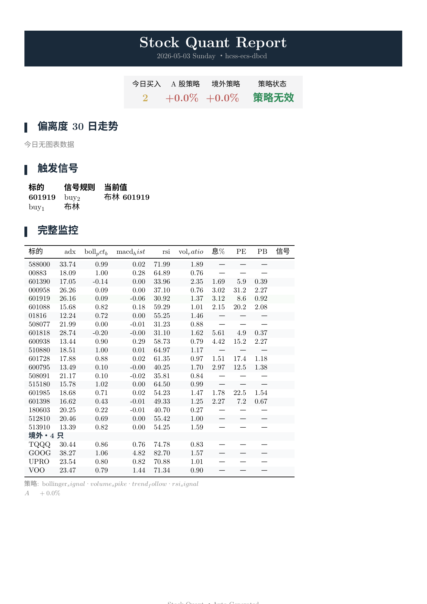

# 股票量化系统 (Stock Quant)

[](LICENSE)
[](https://python.org)
[]()

> **English**: A cross-market quantitative monitoring system for A-shares, US stocks, and HK stocks. Features solver-neutral strategy optimization (genetic, random, and simulated annealing), daily xelatex PDF reports, unified backtesting, and multi-channel notifications.

A股 / 美股 / 港股量化监控系统。策略搜索优化器自动发现最优交易信号，每日 xelatex LaTeX PDF 日报含信号扫描 + 回测分析 + 公式方法论附录，支持 HTML 交互报告链接与 Telegram/飞书多渠道通知。

## 核心功能

| 功能 | 说明 |
|------|------|
| **策略搜索优化器** | 注册策略统一执行 14 窗 Walk-Forward，11 窗排名、2 窗隔离、1 窗留出 |
| **信号扫描器** | 加载单一活动策略参数，直接读取统一 TradePlan 最后有效日事件 |
| **回测分析** | 统一 Backtester、成交价策略与无风险/510300/同池等权三重基准比较 |
| **标的画像审计** | 公司财务推导、利润增长、ETF 前十大穿透及 REIT/商品/债券类型化画像 |
| **条件检测** | 多锚点阈值报警 (MA60/WMA20/WMA30/WMA50) + 优化策略信号报警 |
| **早盘/收盘简报** | 轻量价格+锚点快照，每日 09:50 / 14:30 自动发送，按偏离率升序排列 |
| **邮件提醒** | 日报含信号扫描+回测+公式附录，xelatex LaTeX PDF 附件 (港式财报风格) |
| **健康监控** | HTTP 健康检查服务器 (OTP 认证 + 管理后台 + 在线编辑监控列表) |
| **投资组合策略** | 共享资金池模拟，贪心前向选择，月度限额约束 |
| **规则引擎** | YAML 驱动，Python 表达式沙箱，23 个单元测试 |
| **公式附录** | LaTeX 排版 13 节指标方法论（RSI/布林/MACD/ADX/回测约束），xelatex 编译 |

## 日报预览



> 每日自动生成 LaTeX PDF 日报附件 (145KB)，含偏离度图、信号表、基本面列、公式方法论附录。港式财报风格。

## 快速开始

**首次部署？** → [部署五步走](docs/guide/setup.md)

```bash
pip install -r requirements.txt
cp config/.env.example config/.env   # 填入邮箱和 API Key (DeepSeek)
python main.py --once                # 单次收盘日报
python main.py --brief               # 单次早盘简报
python main.py --optimize            # 策略搜索优化 (15-30 min)
python main.py --activate-run RUN_ID # 人工激活完整且留出通过的候选
python main.py --audit-instruments   # 全量标的画像 JSON + HTML 审计
python scripts/benchmark_technical_strategies.py --solver random --depth 1000 --market-workers 12 --evaluation-workers 1  # 五策略统一基准
python scripts/benchmark_search_throughput.py --candidates 1000  # 标量/批量吞吐验收
python scripts/analyze_search_depth.py  # 1000→10000 搜索边际效应
python main.py                       # 定时运行 (cron/APScheduler)
```

## 项目结构

```
src/
├── analysis/          # 策略优化器、信号扫描、指标库、规则引擎
│   ├── search_controller.py    Solver 无关的预算、缓存、档案和 checkpoint 编排
│   ├── solvers/                 Genetic / Random / 单线 Simulated Annealing
│   ├── evaluation_service.py   策略→TradePlan→Backtester 的标量/批量评价
│   ├── batch_backtester.py      Numba prange 候选批量资金仿真后端
│   ├── candidate_gates.py      hard / penalty / diagnostic 声明式 Gate
│   ├── validation_controller.py 隔离窗、留出窗与局部/删标稳健性边界
│   ├── search_contracts.py     ParameterSchema / CandidateBatch / SearchProblem
│   ├── feature_registry.py     22 列因果、跨标的可比技术特征合同
│   ├── optimizer.py            Walk-Forward 组装及旧 API 兼容层
│   ├── backtester.py           统一资金仿真、三基准与评价报告
│   ├── execution.py            统一买卖成交价、估值价和窗口末待执行策略
│   ├── search_interface.py     StrategyMarketData / TradePlan 契约
│   └── strategies/             注册策略插件（含 regime_pullback / technical_ensemble）
├── core/              # 数据拉取、条件检查、调度管理
├── data/              # 多源爬虫 (新浪/腾讯/Yahoo)
├── alerting/          # 多层报警引擎 + 状态管理
├── session/           # Session 管理器
├── models/            # Pydantic 数据模型
├── instruments/       # 类型化标的、财务推导、基金穿透和审计报告
├── notification/      # 邮件通知 + 图表生成
├── health_server/     # HTTP 健康检查 + 管理
├── utils/             # CJK 字体, ETF 检测
└── templates/         # HTML/CSS 模板
```

## CLI 命令

| 命令 | 说明 |
|------|------|
| `python main.py` | 启动定时调度器 (cron) |
| `python main.py --once` | 单次收盘日报 |
| `python main.py --brief [id]` | 早盘/收盘简报 (`morning_snapshot` / `afternoon_snapshot`) |
| `python main.py --optimize` | 对配置活动策略执行三市场统一 Walk-Forward 搜参 |
| `python main.py --activate-run RUN_ID` | 原子激活三市场完整、留出与稳健性均通过的候选 |
| `python main.py --audit-instruments` | 对全量配置标的生成类型化 JSON 与详细 HTML 审计 |
| `python scripts/benchmark_technical_strategies.py --solver random --depth 1000 --market-workers 12 --evaluation-workers 1` | 冻结各市场行情快照，并行比较五个注册技术策略；可切换 GA/随机/退火，只写诊断产物 |
| `python scripts/benchmark_search_throughput.py --candidates 1000` | 用完整 A 股冻结输入比较同一候选的标量与 CPU 批量评价吞吐、RSS 和一致性 |
| `python scripts/analyze_search_depth.py` | 用同一 RandomSolver 候选流测量 1,000→10,000 搜索边际效果并绘图 |
| `python main.py --health-server` | 仅启动健康服务器 |

## 配置

- `config/config.yaml` — 监控标的、技术指标参数 (gitignored)
- `config/.env` — 邮箱密码、API Key (gitignored)
- `config/optimizer_constraints.yaml` — Solver、Gate、窗口、成交和资源合同
- `config/alerts.yaml` — 多锚点报警配置

## 文档

| 文档 | 说明 |
|------|------|
| [设计决策](docs/llm/proj4llm.md) | 关键架构设计 + 技术路线 |
| [架构说明](docs/architecture.md) | 分层架构、数据流、模块职责 |
| [部署指南](docs/deployment.md) | 服务器部署 + CI/CD |
| [配置参考](docs/configuration.md) | config.yaml 详细说明 |
| [快速开始](docs/guide/quickstart.md) | 5 分钟上手 |
| [开发日志](docs/development/devlog.md) | 版本演进 |

## 测试

```bash
pytest tests/ -p no:capture -q          # 全量测试
pytest tests/ --cov=src                 # 覆盖率报告
pytest tests/test_import_smoke.py       # 模块导入完整性
pytest tests/test_security.py           # 安全测试
```

## Roadmap

| 版本 | 状态 | 内容 |
|------|------|------|
| **v1.17.1** | ✅ 当前 master | 数据源清理（Eastmoney 删除）+ QQ 实时行情 + 优化器 P0 修复 + 布林带列名统一 |
| **v1.18-beta** | 🔄 开发中 | 多渠道通知统一配置（Telegram + 飞书群机器人 Webhook + 邮件，YAML 驱动） |
| **统一策略评估** | ✅ 当前实现 | 单一 `--optimize` 入口；14 个 12/9/3 自然月窗口；统一 TradePlan、Backtester 与 EvaluationReport |
| **v1.18-beta** | 📋 TODO | 给定时间段回测工具：支持自定义起止日期 + 基准对比 + 训练/测试分离 |

> Beta 分支功能稳定后将合并入 master 发布。

## 许可

BSD-3-Clause. 详见 [LICENSE](LICENSE).
