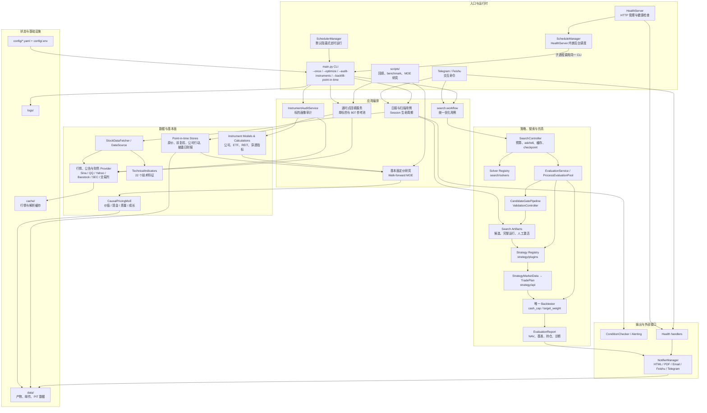

# 项目架构

> 更新时间：2026-08-18。本文只描述当前源码；历史 `src/analysis`、V1/V2
> 优化器和旧回测入口不再是有效架构。

## 当前系统图



## 三条权威业务链路

### 日报、今日扫描与参考持仓

```text
main.py --once
  -> SessionManager
  -> StockDataFetcher / DataSource / TechnicalIndicators
  -> ConditionChecker + AlertEngine
  -> 读取最近一次完整激活的 Search Artifact
  -> 活动 Strategy.make_signals(...) 生成 TradePlan
  -> Backtester 生成 EvaluationReport
  -> NotifierManager 渲染 HTML/PDF/Email/Feishu/Telegram
```

今日信号是完整 `TradePlan` 最后有效交易日的事件；通知层只消费
`EvaluationReport`，不重新计算收益、胜率或持仓。

### 搜参与人工激活

```text
main.py --optimize
  -> search.workflow.run_optimizer
  -> SearchController
  -> Solver.ask()
  -> EvaluationService
  -> Strategy.make_signals()
  -> Backtester
  -> CandidateGatePipeline
  -> Solver.tell()
  -> ValidationController
  -> 完整候选运行产物
  -> main.py --activate-run <run_id>
```

Solver 只能看到排名窗口。隔离窗口、最终留出窗口、策略判断和成交细节不得进入
`ask/tell`。当前 Solver 插件为 `genetic`、`local_genetic`、`random` 和
`simulated_annealing`。

### 逐时点基本面与 MOE 研究

```text
公开行情/官方披露
  -> PointInTimeMarketStore + PointInTimeFundamentalStore
  -> QuarterlyPricingDatasetBuilder
  -> 严格标签实现日切分
  -> CausalPricingMoE
  -> OOS 评价 + 当前无标签 embedding
```

这条链路目前只生成审计和研究产物，不进入活动技术策略。当前指数成员身份只用于
分层诊断，不作为历史特征。

## 包职责与扩展点

| 包 | 负责 | 主要扩展位置 |
|---|---|---|
| `src/strategy` | 参数到买卖决策和 `TradePlan` | `strategy/plugins/*.py` |
| `src/search` | Solver、候选评价、Gate、验证与产物 | `search/solvers/*.py` |
| `src/backtest` | 成交、资金仿真、基准和统一报告 | 通用执行策略，不允许策略 ID 分支 |
| `src/experiments` | 离线 benchmark 与搜索深度分析 | 只读生产接口，不激活产物 |
| `src/data` | 行情、公告、缓存和批量回填 | 新数据源或 store |
| `src/instruments` | 类型化标的、财务推导、ETF/REIT 穿透 | 新官方 provider |
| `src/fundamental_embedding` | 基本面定价数据集、MOE 与验收 | 新专家或独立研究模型 |
| `src/session` / `src/models` | 日报运行态与跨步骤类型模型 | 不放策略判断 |
| `src/notification` | 同一报告对象的多渠道渲染 | 新通知适配器 |
| `src/health_server` / `src/interactive` | 管理接口和 Bot 命令 | 调用应用用例，不复制业务算法 |

新增策略只添加注册插件；新增优化算法只添加 Solver。具体步骤见
[`src/strategy/README.md`](../src/strategy/README.md) 和
[`src/search/README.md`](../src/search/README.md)。

## 架构审计结论

已经形成的稳定边界：

- 策略插件、Solver 插件、候选 Gate 和 Backtester 已分离，新增算法无需修改
  `SearchController`。
- 搜参、日报和扫描共用 `TradePlan + Backtester + EvaluationReport`。
- benchmark 位于 `src/experiments`，不会发布或激活生产参数。
- 逐时点基本面研究与活动技术策略隔离，具有明确的防前视合同。

仍存在的结构债务：

1. **共享合同所有权不够中立。** `TradePlan`、`PortfolioTrace` 和
   `EvaluationReport` 仍位于 `strategy/api.py`；Backtester 必须反向依赖
   strategy，strategy 的兼容扫描又会导入 backtest/search。后续应迁到中立的
   `src/contracts`，使依赖固定为“策略和回测都依赖合同”。
2. **两套调度器仍都在使用。** `SchedulerManager` 服务默认阻塞模式；
   `ScheduleManager` 服务 HealthServer 后台模式和在线改时。它们不是临时重复
   文件，不能直接删除，但应最终合并为一个 runtime scheduler。
3. **`main.py` 仍是大型编排文件。** CLI、日报、扫描、审计和激活用例都集中在
   一个约 62 KB 文件中。应逐步迁到 `src/application`，让 `main.py` 只解析
   参数并分派用例。
4. **Web、交互和通知存在双向导入。** Health handlers、Bot handlers 和
   Notification 通过延迟导入及 global instances 互相访问。建议引入应用服务接口
   和事件发布器，移除 presentation 层之间的直接调用。
5. **数据采集和标的模型存在循环。** `data` 使用 `instruments` 的财务模型，
   `instruments` 审计又调用部分 data provider。后续应把数据合同放入中立模型包，
   provider 作为端口实现单向注入。
6. **搜索窗口/执行配置仍被 Backtester 读取。** `backtest/engine.py` 导入
   `search.config` 的 `WindowStats` 和约束读取函数。应把执行配置与窗口统计迁到
   中立合同，避免搜索层成为基础设施依赖。

这些问题当前有测试覆盖且不会阻止运行；它们是下一轮结构重构的优先顺序，不应在
清理临时文件时顺手删除或改写。

## 运行时状态目录

- `config/config.yaml`、`config/.env`：本地/服务器配置，不进入 Git。
- `cache/`：可再生缓存，但日常运行依赖其提升速度。
- `data/optimizer/`：搜索运行与活动指针。
- `data/point_in_time/`、`data/reference_universe/`：真实逐时点研究数据。
- `data/analysis/`、`data/instrument_audit/`：可再生研究和审计报告。
- `data/email_archive/`、`logs/`：运行审计记录。

Python 字节码、pytest/ruff 缓存、`test_cache/`、`.zcode/`、参考池 smoke
输出和服务器代码中转压缩包都属于临时文件，不应提交。
